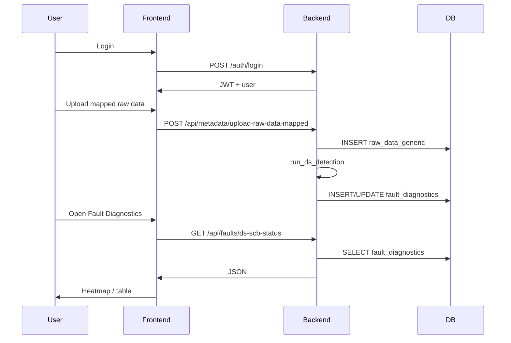

# Solar Analytics Platform — End-to-End Flow & DS RCA Guide

This document explains how the website works (frontend → backend → database → faults) so any engineer or AI can reason about behavior and debug issues.

---

## 1. One-paragraph summary

**FastAPI** serves the **React frontend** (static files + `index.html`) and **REST APIs**. Users authenticate with **JWT**. **Metadata** uploads write **raw time-series** to `raw_data_generic` and **plant structure** to `plant_architecture`. **Disconnected String (DS)** logic runs in **`engine/ds_detection.py`** (on mapped raw upload or via **recompute scripts**) and writes **`fault_diagnostics`**. The **Fault Diagnostics** UI reads **`/api/faults/*`** which queries `fault_diagnostics` (and caches). **Analytics Lab** and **Dashboard** read other routers and mostly `raw_data_generic` / derived tables.

---

## 2. Repository map

| Area | Path | Role |
|------|------|------|
| App entry | `START.bat` | Starts uvicorn on port **8080**, opens browser |
| Backend app | `backend/main.py` | FastAPI app, CORS, mounts frontend, registers routers |
| DB config | `backend/database.py`, `backend/.env` | `DATABASE_URL` → **PostgreSQL only** |
| Auth API | `backend/auth/routes.py` | `/auth/login`, `/auth/signup`, `/auth/me` |
| Metadata API | `backend/routers/metadata.py` | Architecture, equipment, raw uploads; **triggers DS** on mapped upload |
| Analytics API | `backend/routers/analytics.py` | Equipment list, signals, timeseries |
| Dashboard API | `backend/routers/dashboard.py` | KPIs, energy, charts |
| Faults API | `backend/routers/faults.py` | DS summary, SCB status, timeline, filter summary, inverter efficiency, SCB perf |
| DS engine | `backend/engine/ds_detection.py` | Computes rows → `fault_diagnostics` |
| DS batch recompute | `backend/scripts/recompute_ds_faults.py` | Rebuilds `fault_diagnostics` from raw data |
| Fault cache | `backend/fault_cache.py` | DB-backed cache for DS summary / inv eff |
| Frontend API client | `frontend/js/api.js` | `API_BASE`, `fetch`, `window.SolarAPI` |
| Main UI pages | `frontend/js/pages.js` | Auth, Dashboard, Metadata, etc. |
| Fault page UI | `frontend/js/fault_page.js` | Heatmap, table, timeline, modals |

---

## 3. Startup sequence

```
START.bat
  → cd backend
  → uvicorn main:app --host 127.0.0.1 --port 8080
  → browser → http://localhost:8080
```

- **`main.py`** loads **`backend/.env`** into `os.environ` (e.g. `DATABASE_URL`).
- **`Base.metadata.create_all`** ensures tables exist.
- Static frontend is mounted at **`/`**; **`GET /app`** serves **`frontend/index.html`**.
- **`GET /health`** → `{"status":"ok"}`.

**Important:** `frontend/js/api.js` must use **`API_BASE` = `http://localhost:8080`** when using `START.bat`.

---

## 4. Request lifecycle (generic)

1. Browser loads **`index.html`** + JS bundles.
2. **`window.SolarAPI`** (from `api.js`) calls **`fetch(API_BASE + path, …)`**.
3. Protected routes send **`Authorization: Bearer <token>`** (stored in `localStorage`).
4. FastAPI **`get_current_user`** validates JWT and loads `User`.
5. Router handler queries DB, returns JSON.
6. UI updates state and re-renders.

---

## 5. Authentication flow

| Step | Client | Server |
|------|--------|--------|
| Login | `POST /auth/login` `{ email, password }` | Validates user, returns `access_token` + `user` |
| Signup | `POST /auth/signup` | Creates user, returns token |
| Session | `GET /auth/me` | Returns current user from JWT |

Code: `backend/auth/routes.py`, `backend/auth/jwt.py`.  
UI: `pages.js` → `window.SolarAPI.Auth.login` / `signup`.

---

## 6. Metadata & data ingestion

### 6.1 Plant architecture & equipment

- Uploaded via metadata endpoints; stored in **`plant_architecture`**, **`equipment_specs`**, etc.
- DS needs **`scb_id` → `inverter_id`** and **`strings_per_scb`** (string count per SCB).
- **`spare_flag`** SCBs are excluded from DS processing.

### 6.2 Raw data (`raw_data_generic`)

Rows are keyed by:

- `plant_id`, `timestamp`, `equipment_level`, `equipment_id`, `signal`, `value`

Examples:

- SCB DC current: `equipment_level='scb'`, `signal='dc_current'`
- SCB DC voltage: `equipment_level='scb'`, `signal='dc_voltage'`
- Plant / WMS irradiance: `equipment_level` **`plant`** *or* **`wms`** (same meaning); `signal` in `irradiance` / `gti` / `ghi`. See **`docs/WMS_RAW_DATA_MAPPING.md`**.

### 6.3 Mapped raw upload → DS trigger

On successful **mapped raw data** import (`metadata.py`):

1. Bulk insert into **`raw_data_generic`**
2. Call **`run_ds_detection(plant_id, df, db)`**
3. Refresh **`raw_data_15m`** cache (range), invalidate dashboard cache, refresh **`plant_equipment`** / stats

If users add data **without** going through that upload path, **`fault_diagnostics` may be stale** until **`recompute_ds_faults.py`** is run.

---

## 7. Analytics Lab flow

1. UI: pick level (inverter / scb / string / wms).
2. **`GET /api/analytics/equipment`** → equipment IDs  
3. **`GET /api/analytics/signals`** → available signals  
4. **`GET /api/analytics/timeseries`** → time series (may union `raw_data_generic`, `dc_hierarchy_derived`, aggregated inverter rows)

**Inverter `dc_current` / `dc_power`:** The query unions (a) raw rows tagged with `equipment_id = inverter_id`, (b) derived hierarchy rows, and (c) **`SUM` of SCB `dc_current` (or `dc_power`) per inverter** from `plant_architecture`. If raw inverter-level current was never uploaded or is wrong, the chart still uses **(c)**. De-duplication **prefers the SCB aggregate** over raw inverter rows for those signals so totals match the sum of SCBs.

Backend: `backend/routers/analytics.py`, table choice via **`choose_data_table`**.

---

## 8. Dashboard flow

Frontend calls bundled dashboard endpoints (see `api.js` → `SolarAPI.Dashboard.*`).

Backend: `backend/routers/dashboard.py` — aggregates KPIs, energy, weather, inverter performance, etc., often with caching.

**AC energy (Energy Export, daily bars, inverter yield):** kWh is **not** assumed to be 15‑minute data anymore. Integration uses **Σ P[kW] × Δt[h]** where **Δt** comes from consecutive **plant-level** timestamps (all inverters summed per timestamp). A **median** sampling step is inferred from gaps ≤ 6h; very long gaps are **capped** (≤ `8 × median`, minimum 1 minute) so overnight outages do not stretch the last daytime sample across many hours. SQL lives in `backend/ac_power_energy_sql.py`.

---

## 9. Fault Diagnostics flow (Disconnected Strings)

### 9.1 Source of truth

- **Computed table:** **`fault_diagnostics`**
- **Read APIs:** under **`/api/faults/`** in `faults.py`

### 9.2 Typical UI sequence

1. User selects plant + date range.
2. **`GET /api/faults/ds-summary`** — cards (totals, energy, top SCBs); may use **`fault_cache`**.
3. **`GET /api/faults/ds-scb-status`** — per-SCB row for heatmap/table (joins latest row per SCB with **range min** of `missing_strings`).
4. **`GET /api/faults/ds-timeline?scb_id=...`** — time series for investigate modal.
5. **`GET /api/faults/ds-filter-summary`** — which SCBs were dropped by quality filters (constant / leakage / outlier keys).

### 9.3 PostgreSQL (single database)

Fault APIs read **`fault_diagnostics` only from the configured PostgreSQL** (`DATABASE_URL`). There is no SQLite fallback.

### 9.4 Column semantics (what the UI plots)

| DB column | Meaning (typical) |
|-----------|-------------------|
| `virtual_string_current` | Per-string **actual** current (A) ≈ `scb_current / num_strings` |
| `expected_current` | Per-string **reference** current (A) from inverter peers at that timestamp |
| `missing_current` | SCB-level missing amps (expected total − actual total, clamped ≥ 0) |
| `missing_strings` | Integer DS count (after persistence + window-min rules) |
| `fault_status` | `NORMAL` or `CONFIRMED_DS` |
| `energy_loss_kwh` | Per-timestamp energy loss when voltage available |

Frontend often multiplies per-string fields by **string count** to show **SCB total amps** on charts.

---

## 10. DS computation pipeline (RCA checklist)

Use this order when asking **why no detection** or **why false detection**.

### Gate 0 — Data exists?

- Is there **`raw_data_generic`** for that `plant_id`, `scb_id`, `signal='dc_current'`, date range?
- Is there **`fault_diagnostics`** for that same range?  
  - **No rows** → recompute not run or SCB-day removed entirely.

### Gate 1 — Architecture

- SCB must exist in **`plant_architecture`** with valid **`strings_per_scb`**.
- Spare SCBs excluded.

### Gate 2 — Negative current rule (if “remove whole SCB-day on any negative”)

- If **any** timestamp that day has **`scb_current < 0`**, the **entire SCB-day** can be dropped → **no DS for that day**.

### Gate 3 — Outliers

- Drop `scb_current < 0` (after day rule) and `scb_current > num_strings × Isc` (default Isc per string).

### Gate 4 — Constant / flatline

- If current is **constant for > N consecutive timestamps**, **remove SCB-day**.

### Gate 5 — Timestamp window

- **If plant irradiance exists:** keep timestamps where irradiance ∈ **[min, max]** (configurable).
- **Else:** keep **10:00–16:00** only.
- **Night leakage:** if irradiance &lt; threshold and current &gt; 0 → can remove **SCB-day**.

### Gate 6 — Virtual reference (per inverter + timestamp)

- Top percentile of SCBs by **normalized current** → **median** = reference per string.
- If too few SCBs or all filtered → reference may be missing → row dropped.

### Gate 7 — Candidate condition

- Expected SCB current = reference × num_strings.
- Missing current = max(0, expected − actual).
- Candidate if missing current **>** reference (per-string).

### Gate 8 — Disconnected string count (per timestamp)

- `floor(missing_current / reference)` when candidate.

### Gate 9 — Persistence

- Need **≥ 30 consecutive timestamps** (1-minute assumption; tolerance for small gaps) to confirm a fault window.

### Gate 10 — Window minimum

- Within a confirmed window, logged **`missing_strings`** = **min** of per-timestamp counts in that window.

### Gate 11 — UI aggregation

- Heatmap/table may show **MIN(`missing_strings`) over the selected date range** per SCB — so intermittent recovery drives displayed count down.

---

## 11. Common failure modes (quick reference)

| Symptom | Likely cause |
|---------|----------------|
| No DS on a day where raw current looks bad | **`fault_diagnostics` empty** for that day (recompute); or **SCB-day removed** (negative day rule, constant, night leakage, irradiance filter) |
| UI shows DS but “energy N/A” | No **`dc_voltage`** in `raw_data_generic` for that SCB/period |
| Chart date shows activity but table says 0 | **Range MIN** over range includes timestamps with 0 missing_strings |
| PG vs UI mismatch | Wrong `DATABASE_URL` or date range vs data in Postgres |

---

## 12. Mermaid — end-to-end

```mermaid
flowchart LR
  subgraph Client
    UI[Frontend pages.js + api.js]
  end
  subgraph API[FastAPI main.py]
    AUTH[/auth/*]
    META[/api/metadata/*]
    ANA[/api/analytics/*]
    DASH[/api/dashboard/*]
    FLT[/api/faults/*]
  end
  subgraph DB[(Database)]
    RAW[raw_data_generic]
    ARCH[plant_architecture]
    FD[fault_diagnostics]
    FC[fault_cache]
  end
  UI --> AUTH
  UI --> META
  UI --> ANA
  UI --> DASH
  UI --> FLT
  META --> RAW
  META -->|run_ds_detection| FD
  FLT --> FD
  FLT --> FC
  ANA --> RAW
  DASH --> RAW
```



---

## 13. Commands (operators)

| Action | Command |
|--------|---------|
| Start app | Run **`START.bat`** (backend + open browser) |
| Recompute all DS for a plant | `cd backend` → `python scripts/recompute_ds_faults.py --plant <PLANT_ID>` |

---

*Document version: aligned with `backend/main.py`, `routers/metadata.py`, `routers/faults.py`, `engine/ds_detection.py`, and `frontend/js/api.js`.*
